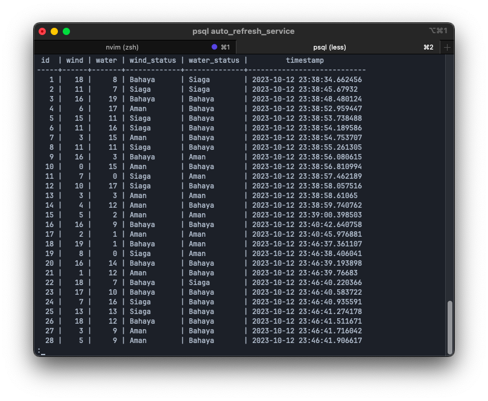
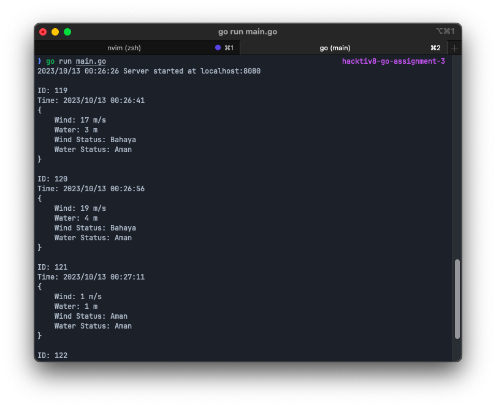

# MSIB Hacktiv8 Go Assignment 3

### Author

- ID : GLNG-KS07-06
- Nama : Fahrul Zaman
- Kelas : GLNG-KS07
- Universitas : Universitas Bale Bandung

### Notes

- [x] Server
  - [x] Connect to Database with native driver
  - [x] Generate Random Wind and Water
  - [x] Store Data to Database
  - [x] Handle Data Request
- [x] Client
  - [x] Connect to Server
  - [x] Request Data
  - [x] Display Data
  - [x] Auto Request Data every 15 seconds

### How to Run

1. Clone this repository and go to the directory
2. Create `.env` file and copy the content from `.env.example` file
3. Run `go mod tidy` to install dependencies
4. Run `go run main.go` to start the service
5. Open `http://localhost:8080` to see the result

### Instructions

Buatlah sebuah service untuk mengupdate data setiap 15 detik dengan angka antara 1-100 untuk water dan wind.
Kemudian buatlah output secara log untuk menampilkan status dari hasil update data tersebut.
Selain itu kalian harus menentukan status water dan wind tersebut.

Dengan ketentuan:

- ika water dibawah 5 maka status amanjika
- jika water antara 6 - 8 maka status siaga
- jika water diatas 8 maka status bahaya
- jika wind dibawah 6 maka status aman
- jika wind antara 7 - 15 maka status siaga
- jika wind diatas 15 maka status bahaya
- water dalam satuan meter
- wind dalam satuan meter per detik

**Data dapat yang di update harus terkoneksi dengan database dan mengubah data di database dengan hit API secara otomatis.**

### Database

### Result

### Thank You

back to [top](#msib-hacktiv8-go-assignment-3)
